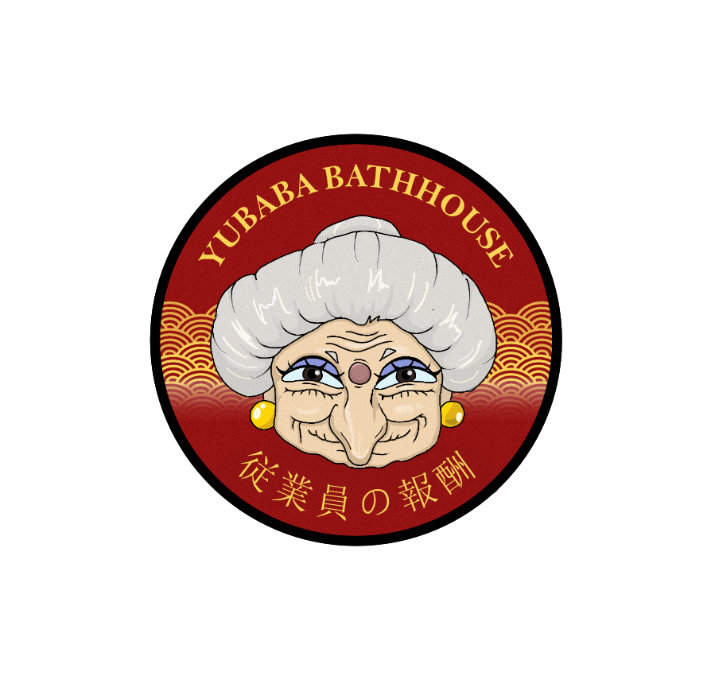

# 🎄 Calendrier de l'Avent Chihiro

Une application web interactive inspirée du film culte du **Studio Ghibli** : *Le Voyage de Chihiro* (千と千尋の神隠し). Ce calendrier de l'Avent propose une expérience narrative immersive où le joueur incarne un personnage qui se retrouve piégé dans l'établissement thermal de Yubaba.



## 📖 Description

Ce projet est un **calendrier de l'Avent interactif** qui combine narration, mini-jeux et découverte progressive. L'utilisateur découvre chaque jour une nouvelle étape de son aventure dans le monde des esprits, en interagissant avec des personnages iconiques du film :

- **Yubaba** : La gérante tyrannique de l'établissement thermal
- **Zeniba** : La sœur bienveillante de Yubaba qui aide le joueur
- **Kamaji** : Le vieil homme-araignée qui travaille dans la chaufferie

## ✨ Fonctionnalités principales

### 🎮 Système de jours progressifs

Le calendrier propose plusieurs journées interactives avec des mécaniques de jeu variées :

#### **Jour 1 : Le Contrat**
- Découverte de l'établissement et rencontre avec Yubaba
- Signature interactive d'un contrat magique sur canvas
- Introduction à l'histoire et vol du nom du joueur
- Apparition de Zeniba qui offre son aide

#### **Jour 4 : Le Nettoyage**
- Mini-jeu de nettoyage d'assiette interactive
- Système de frottage avec détection de mouvement
- Barre de progression visuelle
- Récompense à la fin de la tâche

#### **Jour 24 : La Libération** (Finale)
- Confrontation finale avec Yubaba
- Aide de Kamaji qui donne un ticket de train
- Mini-jeu de destruction du contrat par clics successifs
- Scène finale cinématique avec le train

### 🎨 Éléments visuels et interactifs

- **Animations GIF** : Transitions fluides entre les scènes (porte qui s'ouvre, effets magiques, scènes finales)
- **Système de calques** : Architecture en couches pour gérer les différents éléments visuels
- **Dialogues typewriter** : Effet de machine à écrire pour les dialogues
- **Canvas de signature** : Système de dessin interactif pour signer le contrat
- **Curseurs personnalisés** : Pinceau et chiffon selon le contexte

### 🔊 Design sonore

- **Effets sonores contextuels** :
  - Bruit de machine à écrire pour Yubaba
  - Son de pinceau pour Zeniba
  - Son de magie lors des transformations
  - Effets de nettoyage lors du mini-jeu
- **Musique d'ambiance** : Boucle audio en fond pour l'immersion

### 📱 Progressive Web App (PWA)

L'application est configurée comme une PWA avec :
- Fichier `manifest.json` pour l'installation sur mobile
- Support des métadonnées Apple pour iOS
- Mode standalone pour une expérience app-like
- Icône personnalisée et écran de lancement

### 🎯 Page de vote interactive

Un mini-jeu bonus (`vote.html`) permet de :
- Cliquer sur les Noiraudes (suies) pour donner des étoiles
- Système de score cumulatif
- Animations de particules étoilées
- Alternance d'images au clic

## 🗂️ Structure du projet

```
ProjetWorkshop/
│
├── index.html          # Page principale du calendrier
├── script.js           # Logique du jeu et gestion des étapes
├── style.css           # Styles principaux
│
├── vote.html           # Page de vote des Noiraudes
├── vote.js             # Logique du système de vote
├── vote.css            # Styles de la page de vote
│
├── manifest.json       # Configuration PWA
│
└── assets/
    ├── background/     # Images de fond pour les différentes scènes
    ├── fonts/          # Polices personnalisées
    ├── gif/            # Animations GIF (transitions, scènes)
    ├── sounds/         # Effets sonores et musiques
    └── utils/          # Assets divers (personnages, objets, UI)
```

## 🎯 Mécaniques de jeu détaillées

### Système de signature (Jour 1)

```javascript
// Canvas de signature avec détection de mouvement
- Initialisation d'un canvas HTML5
- Détection tactile et souris
- Compteur de pixels pour validation
- Curseur personnalisé en forme de pinceau
```

### Mini-jeu de nettoyage (Jour 4)

```javascript
// Système de frottage avec barre de progression
- Détection du mouvement (distance parcourue)
- Calcul de progression basé sur les pixels parcourus
- Seuil de 250 points pour compléter la tâche
- Feedback audio et visuel en temps réel
```

### Destruction du contrat (Jour 24)

```javascript
// Système de clics pour briser le contrat
- Images progressives (contrat intact → fissuré → brisé → détruit)
- Animation de tremblement à chaque clic
- 9 clics nécessaires pour venir à bout du contrat
- Transition automatique vers la scène finale
```

## 🎨 Système de dialogue

Le jeu utilise un moteur de dialogue sophistiqué avec :

- **Effet typewriter** : Affichage lettre par lettre avec son
- **Système de speakers** : Changement dynamique de personnage
- **Styles contextuels** : CSS différents selon le personnage qui parle
- **Positionnement dynamique** : Les personnages apparaissent à gauche, droite ou centre
- **Transitions fluides** : Fondu enchaîné entre les changements de personnage

## 🔧 Technologies utilisées

- **HTML5** : Structure et Canvas API
- **CSS3** : Animations, transitions, responsive design
- **JavaScript Vanilla** : Aucune dépendance externe
- **Web Audio API** : Gestion des sons
- **Progressive Web App** : Support offline et installation
- **Touch Events** : Support tactile pour mobile

## 🚀 Installation et lancement

### Prérequis
- Un navigateur web moderne (Chrome, Firefox, Safari, Edge)
- Aucune dépendance externe à installer

### Lancement local

1. Cloner ou télécharger le projet :
```bash
git clone https://github.com/Ethanol410/ProjetWorkshop.git
cd ProjetWorkshop
```

2. Ouvrir avec un serveur local (recommandé pour éviter les problèmes CORS) :

**Option 1 : Python**
```bash
# Python 3
python -m http.server 8000

# Python 2
python -m SimpleHTTPServer 8000
```

**Option 2 : Node.js (avec npx)**
```bash
npx http-server
```

**Option 3 : Extension VS Code**
- Utiliser l'extension "Live Server"
- Clic droit sur `index.html` → "Open with Live Server"

3. Ouvrir dans le navigateur :
```
http://localhost:8000
```

### Installation comme PWA

Sur mobile ou ordinateur :
1. Ouvrir l'application dans le navigateur
2. Suivre les instructions d'installation (bannière ou menu)
3. L'icône apparaîtra sur l'écran d'accueil

## 📱 Compatibilité

### Navigateurs supportés
- ✅ Chrome/Edge (dernières versions)
- ✅ Firefox (dernières versions)
- ✅ Safari (iOS 11.3+, macOS 10.13+)
- ✅ Opera

### Appareils
- 💻 Desktop (toutes résolutions)
- 📱 Mobile (iOS et Android)
- 📲 Tablettes

### Contrôles
- 🖱️ **Souris** : Clic pour interactions, glisser pour signature/nettoyage
- 👆 **Tactile** : Tap pour interactions, glisser pour signature/nettoyage

## 🎮 Guide de jeu

### Navigation
- Cliquer sur les dialogues ou la flèche pour avancer
- Les jours se débloquent progressivement
- Le jour actif est mis en évidence dans le calendrier en bas

### Conseils
- **Jour 1** : Dessinez sur le contrat pour signer (pas besoin d'être précis)
- **Jour 4** : Frottez l'assiette avec des mouvements amples pour remplir la barre
- **Jour 24** : Cliquez rapidement sur le contrat pour le détruire

### Easter eggs
- Explorez les différentes réactions des personnages
- Écoutez attentivement les conseils de Zeniba
- Observez les détails des animations GIF

## 🎨 Assets et crédits

### Inspiration
- **Film** : *Le Voyage de Chihiro* (2001) - Studio Ghibli / Hayao Miyazaki
- **Univers** : Établissement thermal de Yubaba
- **Personnages** : Yubaba, Zeniba, Kamaji, Sen/Chihiro, Noiraudes

### Polices utilisées
- **Abril Fatface** : Titres
- **Amatic SC** : Textes décoratifs
- **Courier Prime** : Dialogues
- **Indie Flower** : Éléments manuscrits

### Structure des assets
```
assets/
├── background/        # Fonds : bureau, hall, Kamaji, train
├── gif/               # Animations : porte, magie, scènes
├── sounds/            # Audio : typing, brush, magic, ambiance
└── utils/             # Sprites, objets, UI, icônes
```

## 🛠️ Architecture technique

### Système de couches (Layers)
L'interface utilise un système de z-index pour superposer les éléments :

```
z-index: 1   → Background (fond statique)
z-index: 10  → Character (personnages)
z-index: 50  → UI (dialogues, boutons)
z-index: 60  → Items (objets collectables)
z-index: 80  → Cleaning/Contract (mini-jeux)
z-index: 85  → Magic effects
z-index: 90  → Menu (calendrier)
z-index: 200 → Final scene (écran de fin)
```

### Machine à états
Le jeu utilise un système de steps pour gérer la progression :

- **currentStep** : Étape actuelle du Jour 1 (0-14)
- **day4Step** : Étape du Jour 4 (0-5)
- **day24Step** : Étape du Jour 24 (0-7)
- **isTyping** : Empêche les clics pendant l'animation de texte

### Gestion d'événements
- **Pointer Events** : Support unifié souris/tactile
- **Touch Events** : Gestion spécifique mobile avec `passive: false`
- **Event delegation** : Optimisation des listeners

## 🔮 Fonctionnalités futures possibles

- [ ] Ajout des jours 2, 3, 5-23
- [ ] Système de sauvegarde locale (LocalStorage)
- [ ] Mode historia pour rejouer les jours
- [ ] Galerie d'artwork débloquable
- [ ] Traduction multilingue (FR/EN/JP)
- [ ] Mode nuit/jour automatique
- [ ] Achievements et collectibles
- [ ] Intégration avec l'API Web Share
- [ ] Mode hors ligne complet (Service Worker)
- [ ] Musiques originales personnalisées

## 🐛 Problèmes connus

- Sur certains mobiles, l'autoplay audio peut être bloqué (nécessite interaction)
- Les GIF peuvent être lourds sur connexions lentes
- Safari iOS peut avoir un léger délai sur les animations Canvas

## 📄 Licence

Ce projet est un fan project éducatif et non commercial, inspiré de l'univers du Studio Ghibli. Tous les droits sur les personnages et l'univers original appartiennent au Studio Ghibli et Hayao Miyazaki.

## 👨‍💻 Auteur

**Projet Workshop** - Développé par Ethanol410
- GitHub : [@Ethanol410](https://github.com/Ethanol410)

## 🙏 Remerciements

- Studio Ghibli pour l'univers merveilleux du Voyage de Chihiro
- La communauté des fans de Ghibli pour l'inspiration
- Google Fonts pour les polices
- Tous les testeurs et contributeurs

---

*"N'oublie jamais qui tu es vraiment."* - Zeniba

🎭 **Bon voyage dans le monde des esprits !** 🏯
